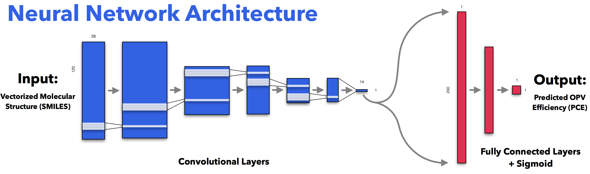

# Sol - Predicting the efficiency of solar cells with AI
Sol learns the relationship between solar cell structure (SMILES) and efficiency (PCE) using a convolutional neural network.

**Here's a diagram of Sol's structure in terms of each layer's feature map:**

Improving the efficiency of organic photovoltaics (OPVs) is an important research objective in the quest to produce cheap, cost-effective solar cells.

Essentially, Sol is a deep neural network that can learn to accurately predict the efficiency of OPVs given only molecular structure.

This provides a potentially powerful new tool for the discovery of highly efficient OPVs, which are a promsing source of renewable energy.

The parsing of SMILES strings is done using [Keras-Molecules](https://github.com/maxhodak/keras-molecules), go check it out!

